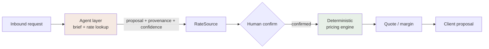

# Beyond the brief — how this scales into AterraAI

The Price screen is one step of a vertical SaaS for DMCs. This is how the whole
thing is shaped, and the one principle that governs it. Deliberately short:
architecture is judgment, not volume.

## The governing principle: decisions and numbers live outside the AI layer

**AI proposes. Deterministic code and humans decide.** No number that touches a
DMC's margin is ever emitted by a language model.

Concretely, already visible in this repo:

- The pricing formula is a **pure module** (`lib/pricing.ts`) — no LLM anywhere in
  the math path. Same inputs, same outputs, every time, testably.
- A supplier rate reaches the screen through **`RateSource`** (`lib/types.ts`):
  `{ document, note, confidence }`. When the AI pipeline reads a rate contract, it
  populates this — the *number comes from the document*, carried with provenance
  and a confidence level, not generated by the model.
- Business thresholds (the blended-margin floor, the client ceiling) are
  **DMC-configured values**, never an AI guess or a hard-coded default pretending
  to be one.
- A human `confirmed` flag gates anything client-facing.

So the AI accelerates data-gathering and drafting; it never decides money.

The green box is deterministic. The tan box is AI. They never swap roles.

## Architecture shape: agent × Nest × Next

Mirrors the Smarthow reference stack.

- **Next (interfaces + BFF):** the itinerary editor, pricing/margin screens,
  proposal workflow, CRM. Server components for reads, route handlers for the
  thin BFF. This exercise is a slice of this layer.
- **Nest (domain API):** owns the domain services and the **pricing engine as the
  single source of truth** (the same pure module, shared), tenancy enforcement,
  persistence, and job orchestration. The interfaces never re-implement pricing.
- **Agent layer (the AI pipeline):** parses inbound requests into structured
  briefs, looks up and reads supplier rates from PDFs/emails, drafts proposals.
  Every output is a *proposal* with provenance + confidence landing in typed
  structures (`RateSource`), never a final figure written straight to a quote.

## Multi-tenancy: many DMCs, data never mixes

- `tenant_id` on every row; **row-level security** in Postgres/Supabase; every API
  path scoped to the caller's tenant; no cross-tenant read is expressible.
- The pricing engine stays **tenant-agnostic pure code**; only data access is
  tenant-scoped. Isolation is a data concern, not a math concern.

## Persistence: a clean seam already exists

`lib/store.ts` exposes `getQuote / saveQuote / updateLine`. That interface is the
seam: swap the in-memory object for Supabase/Postgres behind it and nothing above
changes. The in-memory store ships for this exercise (resets on Vercel cold
start, which the brief accepts).

## Async work: Railway worker + Redis

Rate lookups, supplier chasers, and long PDF parses run **off the request path**
on a background worker — the "worked overnight" story on the product dashboard.
The request stays fast; the slow, flaky, external work is queued.

## Data-model evolution for pax

Today `units` is free text ("2 pax", "1 veh"). To reprice on pax deterministically
it becomes **structured**: `{ quantity, basis, occupancy }` separated from `pax`,
so the engine can decide that a per-person line multiplies while a per-unit line
splits on capacity (a second room, a second vehicle). Capacity rules, not
arithmetic — see [features-and-treatments](./features-and-treatments.md).

## What I'd build next (prioritised)

1. **Real persistence + tenancy** — Supabase/Postgres behind the store seam, RLS.
2. **Structured units + pax repricing** — the data-model evolution above.
3. **The AI rate-ingestion seam** — the agent populates `RateSource` from real
   documents, with confidence surfaced to the consultant.
4. **The full interactive shell** — see [spec-full-shell](./spec-full-shell.md).
5. **The client-facing proposal step** — the "Preview as client" downstream flow.
